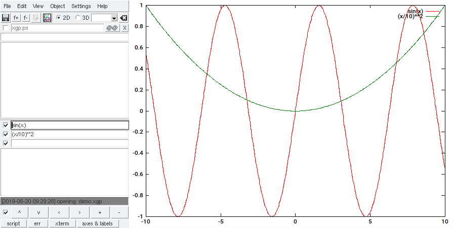

# xgp - tcl/tk gui for gnuplot

 	

xgp provides a GUI for gnuplot. It is a standalone tcl/tk script.

# installation

```bash
wget https://raw.githubusercontent.com/mzechmeister/xgp/master/xgp
./xgp
```
